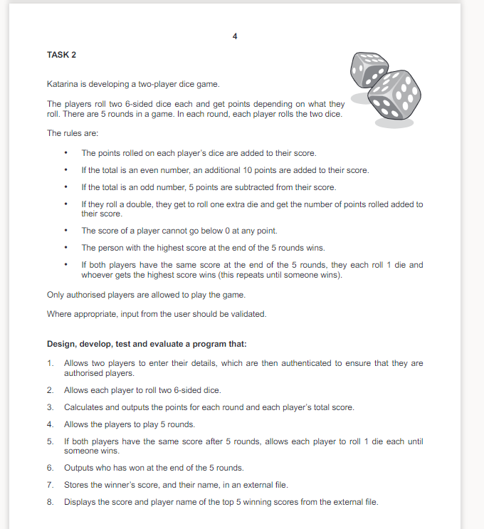

# DiceGame

I have used Django, Django Rest Framework and Django Channels (Websockets) to handle the backend. I have used vanilla HTML, CSS, JS and a CSS library called Bootstrap to handle the frontend. The game supports realtime online multiplayer due to the use of websockets. I have use SQL indirectly as the database through Django's ORM.

[Demo](https://streamable.com/0spi5o)
